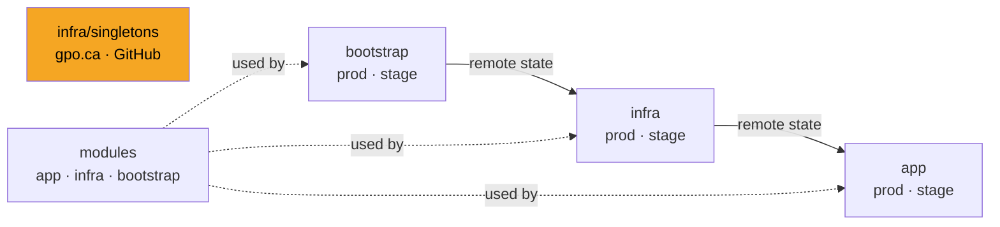

# GPO Platform Configs

Infrastructure as Code for GPO, managed with OpenTofu. Covers Cloudflare (DNS, Pages), GitHub (repos, labels, secrets), GCP/GKE, AWS/EKS, and SOPS secrets.

## Stack layout

`singletons` is **global/production only** — no staging equivalent, changes are live immediately.

## Naming conventions

- Resource names: `snake_case`, environment-qualified where needed (e.g. `cloudflare_record.staging_gpo_ca`)
- Cloudflare zone variable shape: `{ id = string, zone = string }`
- DNS `name` attribute: always the full FQDN (`"staging.gpo.ca"`, not `"staging"`)
- TTL: `1` when `proxied = true`, `300` otherwise
- Toggle flags: `locals {}` block, not `variable {}` (avoids `-var` flags at apply time)

## Documentation index

| Task | Doc |
|---|---|
| Add or change DNS records / zones | [docs/cloudflare-dns.md](docs/cloudflare-dns.md) |
| Deploy a Cloudflare Pages site | [docs/cloudflare-pages.md](docs/cloudflare-pages.md) |
| Create or configure a GitHub repository | [docs/github-repos.md](docs/github-repos.md) |
| GKE, GCP projects, Artifact Registry | [docs/gke-and-gcp.md](docs/gke-and-gcp.md) |
| EKS, VPC, ECR | [docs/aws-eks.md](docs/aws-eks.md) |
| Secrets and SOPS | [docs/secrets-and-sops.md](docs/secrets-and-sops.md) |
| Add an IAM user (AWS or GCP) | [docs/iam-users.md](docs/iam-users.md) |
| Stack boundaries and remote state wiring | [docs/stacks-and-state.md](docs/stacks-and-state.md) |
| Add a new application | [docs/app-layer.md](docs/app-layer.md) |
| Bootstrap a new cloud account | [docs/bootstrap.md](docs/bootstrap.md) |
