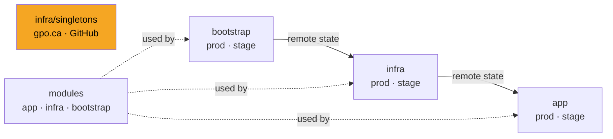

# GPO Platform Configs

Infrastructure as Code for GPO, managed with OpenTofu. Covers Cloudflare (DNS, Pages), GitHub (repos, labels, secrets), GCP/GKE, AWS/EKS, and SOPS secrets.

## Stack layout

```mermaid
graph LR
    B[bootstrap\nprod · stage]
    I[infra\nprod · stage]
    S[infra/singletons\ngpo.ca · GitHub]
    A[app\nprod · stage]
    M[modules\napp · infra · bootstrap]

    B -->|remote state| I
    I -->|remote state| A
    M -.->|used by| B & I & A

    style S fill:#f5a623,color:#000
```

`singletons` is **global/production only** — no staging equivalent, changes are live immediately.

## How change reaches production

Read [docs/pull-requests.md](docs/pull-requests.md) before opening or merging any PR. The invariant it enforces:

- **Stage first, always, as two PRs.** Terraform: stage PR → apply stage → merge → prod PR → apply prod → merge. The apply happens while the PR is open; merging records that it worked. Kubernetes inverts this — ArgoCD deploys on merge — so merge the stage PR, verify the sync, then open the prod PR.
- **Stage and prod run the same code.** Shared logic lives in `tf/modules/` or a shared template; the environments differ only in variables. If the prod PR needs to touch the module, stage never ran what prod is about to run.
- **Record the plan and apply output in the PR body**, for whichever environment that PR targets.
- `tf/infra/singletons/` and `tf/bootstrap/` have no stage tier — put the plan in the PR and get a human to approve before applying.

## Naming conventions

- Resource names: `snake_case`, environment-qualified where needed (e.g. `cloudflare_record.staging_gpo_ca`)
- Cloudflare zone variable shape: `{ id = string, zone = string }`
- DNS `name` attribute: always the full FQDN (`"staging.gpo.ca"`, not `"staging"`)
- TTL: `1` when `proxied = true`, `300` otherwise
- Toggle flags: `locals {}` block, not `variable {}` (avoids `-var` flags at apply time)

## Documentation index

| Task | Doc |
|---|---|
| Add or change DNS records / zones | [docs/cloudflare-dns.md](docs/cloudflare-dns.md) |
| Deploy a Cloudflare Pages site | [docs/cloudflare-pages.md](docs/cloudflare-pages.md) |
| WAF admin protection (gpo.ca + secure.gpo.ca), rate limiting | [docs/cloudflare-waf.md](docs/cloudflare-waf.md) |
| Create or configure a GitHub repository | [docs/github-repos.md](docs/github-repos.md) |
| GKE, GCP projects, Artifact Registry | [docs/gke-and-gcp.md](docs/gke-and-gcp.md) |
| EKS, VPC, ECR | [docs/aws-eks.md](docs/aws-eks.md) |
| Secrets and SOPS | [docs/secrets-and-sops.md](docs/secrets-and-sops.md) |
| Add an IAM user (AWS or GCP) | [docs/iam-users.md](docs/iam-users.md) |
| Stack boundaries and remote state wiring | [docs/stacks-and-state.md](docs/stacks-and-state.md) |
| Add a new application | [docs/app-layer.md](docs/app-layer.md) |
| Bootstrap a new cloud account | [docs/bootstrap.md](docs/bootstrap.md) |
| Plan/apply workflow | [docs/stacks-and-state.md](docs/stacks-and-state.md) |
| Open, review, or merge a PR | [docs/pull-requests.md](docs/pull-requests.md) |

## Cloud agent sessions (Claude Code on the web)

Tooling (`opentofu`, `pre-commit`, `sops`, `jq`, `argocd`, `helmfile`, `yq`, `helm`, `gh`, `aws`) installs via `claude/cloud-environment-setup.sh`, fetched by the environment's Setup Script — see the "Claude Code cloud environments" section in README.md. Check `~/.cloud-setup-errors.log` at session start and report if non-empty.

`registry.opentofu.org` is not reachable from this environment: `terraform_validate` and `terraform_providers_lock` fail under `pre-commit run --all-files` for that reason, not a tooling problem. `terraform_fmt` works fine (local-only).
