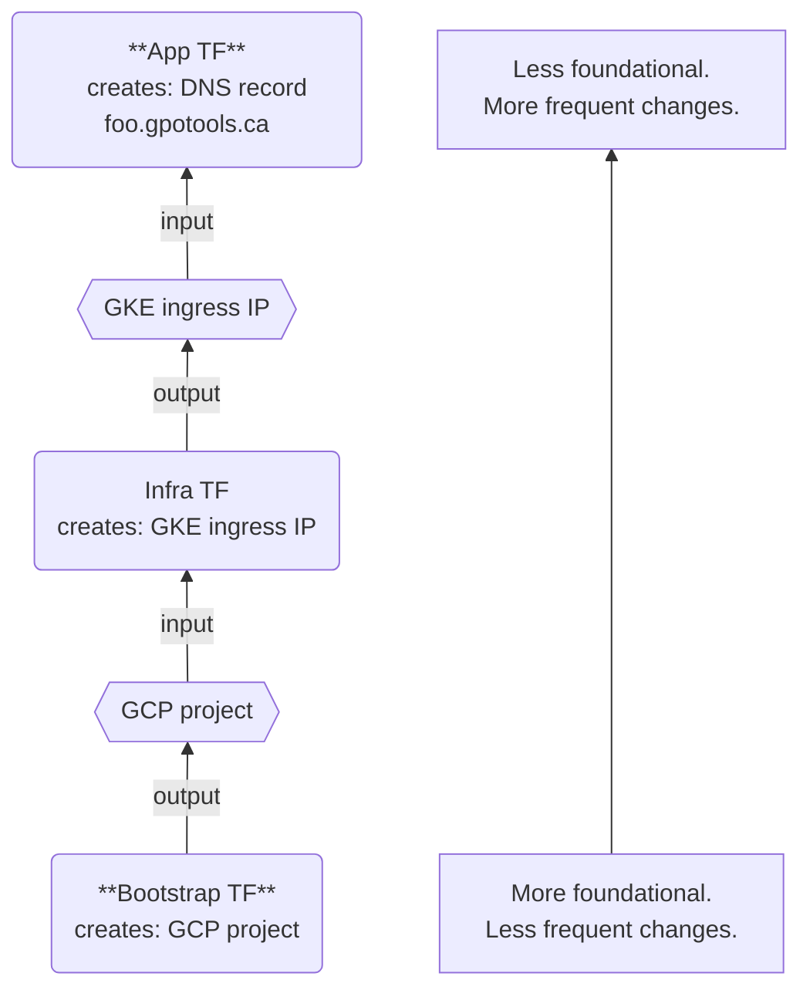

# TF Organization

> Note: we use [opentofu](https://opentofu.org/) as our IaC tool of choice, but to avoid confusiion we just use "tf" throughout our docs, code, and scripts when refering to it.

The tf code is organized into multiple states (AKA "stacks" AKA "compositions"), which is to say that you can run `tf apply` in each of these directories.

Below is a list of our states in order from "lowest" to "highest". Or put another way, **most** foundational (ie. **least** likely to need changes) to **least** foundational (ie. things that _consume_ resources provided by layers below them, and are more likely to change more frequently).

Each one of these states has a `./prod/` and a `./stage/` subdir, with hardcoded GCP projects, state buckets, and local parameters which are suitable for either prod or stage, and nearly everything else is just calling the exact same tf modules.

## [bootstrap](./tf/bootstrap)

Contains resources for bootstrapping TF. That is, this helps get a brand new GCP account from zero to one, ready to start deploying the higher level infrastructure.

Eg. User accounts, KMS keys, GCP projects, TF state buckets.

## [infra](./tf/infra)

Contains resources which exist **in** the GCP projects provided by bootstrap and which support app level resources.

Eg. VPC's, GKE clusters, container registries.

## [app](./tf/app)

Contains resources which directly support our workloads which run **in** the GKE clusters provided by the infra layer.

Eg. DNS records (fooapp.gpotools.ca), service accounts, IAM policies.

---

## [infra/singletons](./tf/infra/singletons)

This is a one off, unrelated to the hierarchy above. Has no prod/stage isolation. Contains resources we only have one of. This is mostly legacy stuff, unrelated to GCP and Kuberentes.

---

# Rationale

This layout offers some desireable features:

* It is very easy to accidentally introduce circular dependencies to TF over time. This layout helps avoid circular dependencies. Resource references only ever flow from bottom to top, not back from top to bottom.

* It is extremely difficult to accidentally apply to the wrong environment. You don't have to remember to switch to the correct workspace, or export the right environment varaibles. All these things are hard coded into each composition. You have to `cd` into `./prod` to apply to production.

* Heavy module reuse ensures the infrastructure configs we test in staging are identical to what we deploy in production. We do have _some_ tf states which directly create resources without modules, there are certain use cases where it makes sense. If you need to do this expect to get pushback on your PR and be ready to justify the need.
